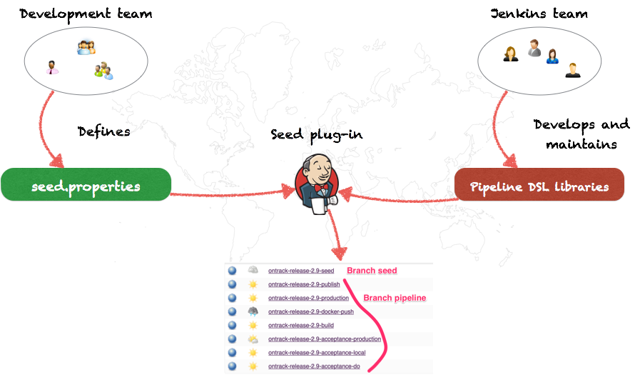
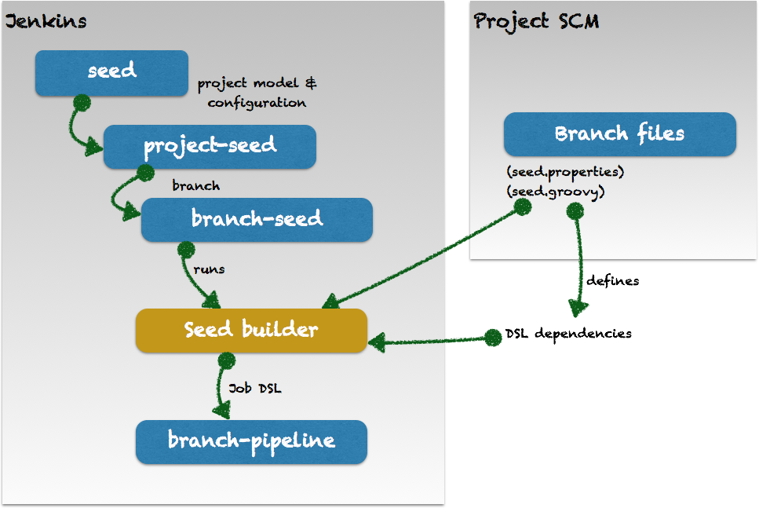
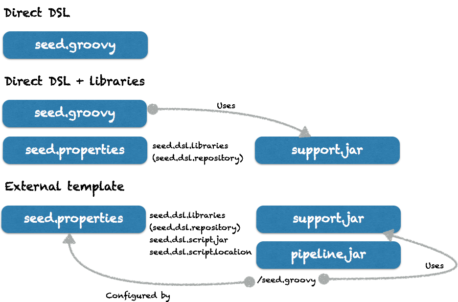
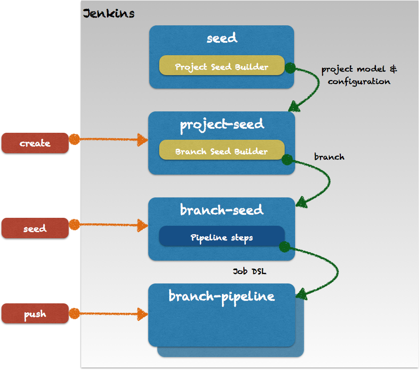

Seed Jenkins plug-in
====================

The Seed project aims to help automating the generation and management of pipelines
for branches of a project in Jenkins, by splitting the definition of pipelines using the Job DSL and their use and parameterization by actual projects.

The following presentations are available about the story of the Seed plug-in and its use in a large scale set-up:

* [Jenkins User Conference, London, June 1025](https://www.youtube.com/watch?v=DC6e9mhYOg8)
* [BruJUG presentation, Brussels, March 2016](http://www.slideshare.net/DamienCoraboeuf/brujug-jenkins-pipeline-scalability)

The Seed structure can be generated automatically

* seed --> project seed
* project seed --> branch seed for a given branch
* branch seed --> pipeline for this branch

The branch pipeline generation is configured using some files on the branch. Different setup are possible according to the level of isolation and reuse you want for a project:

* in the direct DSL mode, the branch contains directly the Job DSL script which defines its pipeline
* if this script needs extra helper classes, a property file can be added to define a list of dependencies to download and associate to the classpath of the Job DSL script
* finally, if a direct script is not possible for reuse or security reasons, the Job DSL script itself can be downloaded from an external pipeline library

The plugin implementation is illustrated by the diagram below:

## Documentation

Documentation is available in the [Wiki](https://github.com/jenkinsci/seed-plugin/wiki).

## Quick links

* [Quick start](https://github.com/jenkinsci/seed-plugin/wiki/Quick-start)
* [Configuration](https://github.com/jenkinsci/seed-plugin/wiki/Configuration)
* [GitHub configuration](https://github.com/jenkinsci/seed-plugin/wiki/GitHub)
* [Migration from version 0.x](https://github.com/jenkinsci/seed-plugin/wiki/Migration-from-0.x)
